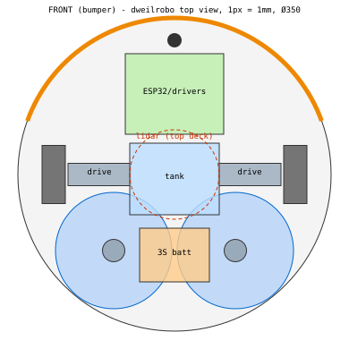

# dweilrobo — Engineering Study v0.1

Status: **pre-CAD study**. Nothing here is a purchase decision yet.
Companion files: `cad/layout.py` (parametric layout + load/traction checks), `cad/layout_top.svg` (its output).

Prices are **estimates** of typical 2026 AliExpress prices, not verified listings. The linked, verified BOM is the last step, done after the measurements in §11 are locked. That order is the CAD-first rule you set.

---

## 0. Summary

| Question | Answer |
|---|---|
| Is the €50–70 target realistic? | **Not with reliable mapping.** With a lidar, a robust MVP costs **€100–120** (recommended), or **€80–90** if you reuse cells and consumables. **€65–70** is possible only with no lidar and an old phone as a fixed overhead camera. See §13. |
| Minimum sensor set for real mapping + carpet avoidance | Wheel encoders + gyro (IMU) + **used Xiaomi LDS02RR lidar (~€16)** + 2 bumper switches + 2 downward ToF + the mop-motor encoders. Carpets are **no-go zones drawn on the map**. The onboard sensors are only a safety interlock. |
| Mop moisture sensing | **Don't make it the control loop.** Meter the water per pad by volume (mL/m²) with two peristaltic pumps. Commercial robots do the same. A direct sensor is a phase-3 experiment. See §4. |
| Battery | 3S1P 18650 (11.1 V, ~3 Ah, ~33 Wh), 3S BMS, 5 A fuse. Gives ~1.5 h against a ~17 W average draw. **Buy the cells from an EU shop, not AliExpress.** |
| Motors | 4× the same **JGA25-370 12 V ~130 rpm with Hall encoder**: 2 drive, 2 mop. One SKU gives you spares and stall detection everywhere. |
| Biggest mechanical risk | **The spring force on the mops takes load off the drive wheels.** The layout must keep enough weight on the wheels as the tank drains. `cad/layout.py` checks this, and the first layout **failed** it (§6.3). |

---

## 1. Where your spec is technically weak (read this first)

1. **"Measure each mop's moisture and regulate to 65%" is not practical with cheap parts.** The pad spins, gets dirty, and holds detergent. Its conductivity depends on water hardness and soap far more than on wetness. Resistive probes corrode (electrolysis). A capacitive sensor on a rotating, bouncing pad sees a varying air gap. No commercial mopping robot measures pad moisture. They all dose by area and time. → Control water **per square metre per pad**, and treat "moisture %" as an estimate the model calculates (§4).
2. **Odometry alone will not tell you "where have I cleaned".** A wet floor plus two rotating pads pulling sideways makes the wheels slip. You need an absolute reference. Lidar is the cheapest reliable one; a fixed overhead camera is the cheapest overall (§7).
3. **A camera on the robot is not the cheapest way to localize.** Visual SLAM from an ESP32-CAM over Wi-Fi has low fps, variable latency, motion blur and a camera 10 cm above a featureless floor. That is a research project. Use a camera for recognition later, not for pose.
4. **Your mops cannot lift, so the robot can never drive over a carpet.** Commercial robots lift their pads or detach them at the dock. We don't. So carpets are hard no-go zones, **inflated by the robot radius plus a margin**, because the pads sit behind the axle and swing when the robot turns.
5. **Automatic carpet detection with a €0.50 IR reflectance sensor (TCRT5000) is unreliable.** It measures colour and brightness, not material: a dark floor looks like a dark rug. The reliable signals are map zones, a height step at the rug edge, and extra drag on the pads.
6. **AliExpress 18650 cells** are the one AliExpress category to avoid ("9900 mAh" fakes, unknown chemistry). Saving €5 here risks a fire.
7. **4S is the wrong choice** here. The cheap, good H-bridge (TB6612FNG) is rated to 13.5 V, and 12 V motors are the common variant. 3S (9.0–12.6 V) matches both.
8. **The €50–70 target and "reliable map + coverage + carpet avoidance" pull against each other.** By your own rule (buy the €6 part if it makes the robot robust), the lidar earns its €16.
9. **Which ESP32 do you have?** The classic ESP32 (WROOM) and the S3 have hardware pulse counters (PCNT) for 4 encoders. **The ESP32-C3 has no PCNT and too few pins** — unsuitable as the main controller. The pin budget (§8.3) fits a classic DevKit with only 1 pin to spare.

---

## 2. Subsystem breakdown

```
MECHANICAL                 ELECTRICAL                     SOFTWARE
- base plate / frame       - 3S battery, BMS, fuse,       ESP32 firmware (real time)
- 2 drive pods               switch, charge jack            - wheel PID, odometry, IMU
  (motor+wheel)            - 5 V buck (ESP32, lidar)        - mop + pump control
- front caster             - 3x TB6612FNG                   - safety reflexes, watchdog
- 2 floating mop modules     (drive / mops / pumps)         - lidar driver, telemetry
- tank + cradle            - encoders, IMU, INA219        Server (ROS 2 in Docker)
- 2 pump brackets          - 2 ToF, 2 bumper switches       - bridge (UDP <-> topics)
- sealed battery box       - LDS02RR lidar                  - slam_toolbox (map/pose)
- electronics tray + lid   - wiring, connectors             - Nav2 + keep-out mask (carpet)
- front bumper                                              - coverage planner + cleaned layer
- lidar deck                                                - mop manager (dosing)
                                                            - dashboard (Foxglove / web)
```

---

## 3. Critical unknowns, ranked

| # | Unknown | Why it matters | How to settle it (cheap) |
|---|---|---|---|
| U1 | Pad friction coefficient and torque on **your** floor | Sizes the mop motors, drag, spring force | Bench test: a disc with a cloth, a known weight, a luggage scale on a lever arm |
| U2 | Wheel traction on a wet floor | Everything depends on the wheels not slipping | Pull test with the scale on a wet floor |
| U3 | Floor type (tile vs laminate/parquet) | Laminate/parquet tolerates very little water → dose limits | Tell me |
| U4 | Clearance under sofa / TV cabinet | Sets the maximum height (the lidar turret makes the robot ~150 mm tall) | Measure |
| U5 | Rug types and edge heights; do rugs move? | Moving rugs make map zones unreliable → onboard detection gets more important | Measure / tell me |
| U6 | Real dimensions of the chosen motor, pump, lidar and holder variants | The CAD depends on them; listings vary by ratio and seller | Measure after ordering **one** of each (§11) |
| U7 | Your ESP32 board | PCNT and pin count | Tell me the board name |
| U8 | 3D printer and bed size | Frame split into segments vs plywood | Tell me |

---

## 4. Moisture and water system

### 4.1 Sensing options, judged

| Method | Works? | Why |
|---|---|---|
| Resistive (2 electrodes in the pad) | Poor | Electrolysis corrodes the electrodes; reading depends on hardness and soap; contact on a rotating pad wears it |
| Capacitive (soil-sensor type) | Poor on a moving pad | Varying air gap, bounce, dirt. Works on a *stationary* reference sponge only |
| Conductivity with AC excitation | Relative trend only | Needs per-session calibration (dry vs soaked); still drifts with soap |
| Mop-motor load (encoder rpm at fixed PWM) | Weak for moisture | Floor, dirt and carpet dominate the signal. **Excellent for carpet/snag detection though** |
| **Metered water delivery (peristaltic)** | **Yes** | Volume per pump revolution is repeatable ±5–10%. Known mL/m² per pad is the quantity that matters |
| Tank level (capacitive, through the wall) | Yes | ESP32 touch pin + 2 copper-tape electrodes on the outside of the tank. Free. Detects empty tank and cross-checks the pumped volume |

### 4.2 Control approach (MVP)

```
target_dose  [mL/m²]   (per floor type, e.g. start at 3–5 mL/m², calibrate)
area_rate    [m²/s]  = speed × pad_width (from odometry, per pad)
pump_rate    [mL/s]  = target_dose × area_rate  (+ a pre-wet burst at start)
pump_pwm            ← calibration table mL/s → PWM (measured with a cup)
wetness_est  (per pad) integrates dosed water minus a transfer model, shown as your "LEFT 60% / RIGHT 43%"
```
Pumps stop immediately when the robot stops, a carpet or cliff is suspected, the tank is empty, the robot enters a no-go zone, or the server link is lost.

### 4.3 Pump choice: **two peristaltic pumps**, no splitter

- **One pump + Y-splitter:** the flow splits by tube resistance and air bubbles, so you can't control it per side. Cheap but gives an uneven result.
- **Diaphragm pump:** far too much flow (~1 L/min) for ~20 mL/min, and it **siphons/leaks when off**, so it needs a check valve and solenoid.
- **Peristaltic pump:** self-priming, **seals when stopped** (no leaks, no valves), flow ∝ speed, tolerates running dry. A second pump costs ~€5. **Worth it.** Pick the **low-flow variant (1×3 mm tube, ~5–40 mL/min at 12 V)**.

Flow needed: 5 mL/m² × 0.2 m/s × 0.27 m ≈ 0.27 mL/s ≈ **16 mL/min total**. A 25 m² room at 5 mL/m² uses ~125 mL, so a 300 mL tank is enough.

### 4.4 Leak-proof tank

- **No holes in the bottom of the tank.** The suction tube enters through the lid and reaches the bottom (weighted tip). Refilling = lift the lid and pull the tube out.
- The tank sits **over the axle** (so the balance doesn't change as it drains, §6.3). A drip tray under it drains *away* from the electronics.
- Pump → silicone tube → **stationary drip nozzle** over an annular trough in the rotating pad disc → holes → cloth. There is no rotating seal.

---

## 5. Motors, wheels, mops

### 5.1 Requirements

Mass ≈ **2.2 kg full** (see `cad/layout.py`).

- Drive: cruise 0.2 m/s, max ~0.4 m/s. Force ≈ rolling resistance (~0.6 N) + pad drag (~1.1 N while spinning, ~3.7 N if stalled) + a threshold/ramp margin → design for **~4 N total, ~2 N per wheel**. With a 65 mm wheel that is 0.065 N·m ≈ **0.7 kg·cm per motor** continuous, and more to climb a threshold.
- Speed: 0.4 m/s ÷ (π × 0.065 m) ≈ 118 rpm → **~130 rpm at 12 V**. It still gives ~100 rpm at 9.6 V; the PID handles the difference.
- Mops: friction torque ≈ ⅔·μ·N·R = ⅔ × 0.5 × 3.7 N × 0.065 m ≈ **0.8 kg·cm per pad**, 120–200 rpm.

### 5.2 Choice: JGA25-370, 12 V, ~130 rpm, with Hall encoder (×4)

- Gearbox Ø25 mm, 4 mm D-shaft (~10–12 mm long), 2× M3 on the gearbox face (spacing reported as 17 mm in some drawings — **VERIFY**), 11 PPR Hall encoder → ~1500–2000 counts per wheel revolution after ×4 decoding and the gear ratio. Rated torque at 130 rpm is roughly 1–2 kg·cm, stall much higher: enough margin for both jobs.
- Alternatives rejected:
  - **N20**: too weak for 2.2 kg plus pad drag.
  - **TT yellow motor**: plastic gears, backlash, poor encoders.
  - **BLDC**: needs an extra controller per motor and costs more, for no gain at these speeds.
- Mops use the **same SKU**: identical spares, and the encoder gives mop rpm, which is the carpet/snag/stall signal. Budget option: mops without an encoder (−€5 total), but then you lose that signal.
- Height: a vertical mop motor with encoder stands ~70 mm above the plate. If the height budget (U4) is tight, the lower alternative is the **JGY-370 worm-gear** motor mounted flat (right-angle output).

### 5.3 Wheels and caster

- 65 mm rubber wheels on a 4 mm D/hex coupler, or a printed hub with a TPU tyre. Axle height 32.5 mm → motor underside at ~20 mm → **ground clearance 20 mm**, enough for thresholds up to ~10 mm.
- One ball caster at the front (x = +150 mm). No rear caster: the mops are the rear support.

### 5.4 Mop module (floating)

```
      motor (fixed to plate, shaft down)
          │ 4 mm D-shaft → printed hex adapter
  ════════╪════════  base plate (z≈45–49)
          │  hex slider: hub slides ±8 mm on hex
       [spring]  preload screw → 2–5 N per pad
     ┌────┴────┐  TPU flex ring → a few degrees of tilt
     │ disc Ø130│  annular water trough + holes, hook tape underneath
     └─────────┘  microfiber pad (cut from cloth or bought circles), z 0–12
```
Pads: **Ø130 mm**, counter-rotating so the side forces cancel. The gyro heading loop corrects any leftover yaw. To swap a pad, pull it off the hook tape.

Known limitation: the pads sit ~42 mm inside the outline, so a strip ~4 cm wide along the walls stays unmopped. That is acceptable for v1.

---

## 6. Physical layout

### 6.1 Top view (from `cad/layout.py`)

Round Ø350 mm body, drive axle through the centre (so it can turn in place), mops at the rear, electronics at the front and top, water and battery away from the electronics.



| Item | Position (x fwd, y left) mm |
|---|---|
| Drive wheels | x 0, y ±135 |
| Mop centres | x −85, y ±68, Ø130, 6 mm gap between them, 10 mm clearance to the wheels |
| Front caster | x +150 |
| Tank 80×100×50 (~330 mL usable) | over the axle, x −45…+35 |
| Battery 3S1P in a sealed box | between the mop motors, x −120…−60 |
| Electronics tray (ESP32, 3× TB6612, buck, INA219) | front, x +45…+135, raised, with a lid |
| Lidar | top deck, centred over the axle, highest point |
| Bumper | front 140° arc, 2 micro-switches |
| Cliff/rug-edge ToF ×2 | front-left/right, under the bumper, facing down |

### 6.2 Side stack (z)

| z (mm) | Layer |
|---|---|
| 0–12 | microfiber pad + disc |
| 12–30 | sliding hub, spring, ±8 mm travel |
| 20–45 | drive motors (axle at 32.5) |
| 45–49 | base plate (4 mm plywood or 3 mm PETG) |
| 49–100 | tank, pumps, battery box, electronics tray |
| 49–~120 | mop motors (vertical, with encoder) |
| ~125 | top deck |
| ~125–~165 | LDS02RR turret (**VERIFY height**) |

**Total height is about 160 mm.** This robot won't fit under most sofas. Decide this with measurement U4 before CAD.

### 6.3 Weight distribution — the check that failed first

Three groups carry the chassis: the wheels, the caster, and the mop springs. The spring force on the mops **pushes the chassis up** and puts load on the caster, both of which **take load off the wheels**. First layout (tank at the rear, battery in front, 4 N per pad):

```
[empty tank] traction 1.6 N vs stalled-pad drag 4.0 N   FAIL
```
Fix (current layout, all checks OK):
- The **tank goes over the axle**, so draining it doesn't move the centre of gravity (CG x ≈ −9 mm full and empty).
- The **battery goes behind the axle**.
- Spring preload is **3 N per pad** (adjustable 2–5 N), and the caster moves forward to x = +150.
- Result: wheel load 8.7–12.1 N → traction 3.5–4.8 N vs ~1.1 N drag with the pads spinning (≥3× margin).
- A **stalled pad (3.7 N drag) is at the traction limit**, so the firmware must stop the drive when mop rpm collapses. That also serves as the carpet/snag reflex.

Rule for the CAD: **any change to mass or position → rerun `python3 cad/layout.py`**. It exits non-zero on failure.

### 6.4 Water protection

Water sits rear/low, electronics front/high, with a printed splash wall between them. Keep the battery box sealed, route tubes with drip loops, put the electronics lid on top, and don't route water tubing over the electronics tray.

---

## 7. Navigation, mapping, localization

### 7.1 Comparison

| Option | Cost | Gives | Verdict |
|---|---|---|---|
| Wheel odometry | €0 (encoders) | Short-term motion | Needed, but drifts (slip on a wet floor) |
| IMU gyro (BMI160/MPU6050) | €2 | Heading, much better than odometry for turns | Needed |
| Front ToF array | €2 each | Near obstacles in a narrow cone | Nice-to-have; the bumper covers low obstacles |
| Ultrasonic | €1 | Wide, noisy, poor at angles | No |
| **2D lidar LDS02RR (used, ~€16)** | €16 | 360° scan → occupancy map, localization, obstacles | **Yes, the best value per euro.** Supported on ESP32 by the [kaiaai/LDS](https://github.com/kaiaai/LDS) library |
| New lidar (LD06/LD19/RPLIDAR A1) | €60–100 | Same, new | Only if the used LDS02RR disappoints |
| Fixed overhead camera + ArUco marker on the robot | €0 (old phone) to €20 | Absolute pose, top-down view, easy carpet drawing | **The €65 variant / backup.** Single room only, blocked under furniture, poor at night |
| ESP32-CAM on the robot | €7 | Recognition, future learning | Phase 4. Not for localization |
| Visual odometry / visual SLAM | — | — | Too fragile at this cost/latency |

### 7.2 Recommended MVP stack

- **ESP32:** reads the encoders (PCNT) and the gyro at 200 Hz, runs wheel-speed PID, and fuses them into an **odometry frame**. It also reads the LDS02RR and sends out scans.
- **Server:** ROS 2 in Docker.
  - `slam_toolbox` builds the map once, then localizes in it (map→odom correction).
  - Nav2 plans paths, with a **KeepoutFilter mask = carpets**.
  - A coverage node plans boustrophedon lanes (220 mm spacing = 266 mm pad width − 46 mm overlap) plus a clean-up pass over missed cells.
  - A **cleaned layer**: a 2 cm grid where cells under the two pad footprints are marked while the pads spin and are wet.
- **Command boundary** (your "no LLM on PWM" rule):
  - The server sends `(v, ω)` at 20 Hz with a 300 ms time-to-live, or motion primitives (`drive d at θ`, `rotate to θ`).
  - The ESP32 does all closed-loop control and owns every safety reflex.

### 7.3 Carpet strategy (your A vs B)

**B (map zones) is primary; A is a safety interlock.**
1. Draw the carpet polygons once on the map in the dashboard → keep-out mask, inflated by the robot radius plus 5 cm.
2. Interlocks (any one triggers pumps off → stop → back off):
   - The downward ToF sees the floor **rise ≥ ~5 mm** (rug edge) or **drop ≥ 25 mm** (cliff).
   - Mop rpm at fixed PWM drops (pad on pile or snagged).
   - Bumper hit.
3. Later: an ESP32-CAM with a small classifier on the server for rugs that move. Thin rugs (<5 mm) are only reliably handled by the map.

---

## 8. Electrical

### 8.1 Power budget (averages at cruise)

| Load | Avg | Peak |
|---|---|---|
| Drive 2× JGA25 | ~5.5 W | ~2 A each at stall (limited in firmware) |
| Mops 2× JGA25 | ~6.5 W | ~2 A each at stall |
| Pumps 2× (low duty) | ~1 W | 0.4 A each |
| LDS02RR (5 V) | ~2 W (**VERIFY**) | — |
| ESP32 Wi-Fi + sensors | ~1 W | 0.5 A bursts at 3.3 V |
| Buck losses | ~0.5 W | — |
| **Total** | **~17 W** | Realistic peak 3–4 A |

### 8.2 Battery and protection

- **3S1P 18650**, 3 × ~3000–3500 mAh (e.g. Samsung 35E / Molicel from an EU shop, or tested laptop cells). ~33 Wh, 80% usable → **~1.5 h**. A room takes ~15–25 min, so 1P is enough; add a second parallel string (2P) only if you add a second room.
- 3S **BMS with balancing**, ~10 A.
- **5 A fuse** right after the BMS, then a 10 A rocker switch (hard kill), then distribution.
- Charging: a dedicated **12.6 V CC/CV charger** into a DC jack wired to the BMS input. Never charge through the BMS alone. The dock later just parallels the DC jack.
- Rails: V_BAT goes to the 3× TB6612. A Mini560 buck (5 V, 3 A) feeds the ESP32's 5 V pin and the lidar. 3.3 V comes from the DevKit's LDO for the IMU, INA219, ToF and encoders (**power the encoders at 3.3 V**).
- Measurement: an INA219 on the main line gives battery voltage and current (the ESP32 ADC is too nonlinear).
- Wiring: 18 AWG main, 22–24 AWG motors, XT30 for the battery, JST-XH/PH for signals (JGA25 encoders come with a 6-pin PH2.0 lead).
- **Drivers:** TB6612FNG (4.5–13.5 V, 1.2 A continuous / 3.2 A peak per channel). No L298N (2 V loss, heat). DRV8833 is out (10.8 V max).

### 8.3 ESP32 pin budget (classic WROOM DevKit, ~24 usable GPIO)

| Function | Pins | Note |
|---|---|---|
| Drive encoders A/B ×2 | 4 | PCNT; input-only GPIO 34–39 OK |
| Mop encoders A only ×2 | 2 | Speed only; direction is fixed |
| Drive TB6612 | 4 | PWM on IN1/IN2, PWMx tied high |
| Mop TB6612 | 2 | Direction hard-wired, PWM only |
| Pump TB6612 | 2 | Same |
| Shared STBY (e-stop) | 1 | Low = all motors off |
| I2C (IMU, INA219, ToF ×2) | 2 | |
| ToF XSHUT | 1 | Re-address the second ToF at boot |
| Bumpers L/R | 1 | Resistor ladder on one ADC pin |
| Lidar RX + motor PWM | 2 | UART2 |
| Tank level | 1 | Touch pin |
| Status LED | 1 | |
| **Total** | **23 / ~24** | Tight → add a PCF8574 (€1) for margin, or use an ESP32-S3 |

---

## 9. Software architecture

### 9.1 ESP32 firmware (Arduino-ESP32 or ESP-IDF on FreeRTOS)

- `control` task, 100 Hz: encoders → wheel-speed PID → PWM; heading hold on the gyro; odometry integration; mop rpm loop; pump PWM from the dose rate.
- `sensors` task, 50–200 Hz: IMU (200 Hz with a bias estimate whenever the robot stands still), ToF (30 Hz), bumper (interrupt), INA219 (10 Hz), tank level (2 Hz).
- `lidar` task: LDS02RR decoding plus lidar motor speed control (kaiaai/LDS).
- `comm` task: UDP. Telemetry out at 50 Hz and scans at ~5 Hz (sequence number and timestamp in each). Commands in, each with a TTL.
- **Safety (always local, never waits on the server):**
  - Command expires (>300 ms) → stop the drive, pumps off, mops spin down.
  - Bumper or cliff → stop and reverse 3 cm.
  - Stall (PWM high, rpm ~0) → stop.
  - Rug-edge signal or mop-rpm drop → pumps off, stop.
  - Low battery (<9.6 V) → pumps off, return home.
  - Brown-out → everything off.

### 9.2 Server

- A Python **bridge** (UDP ↔ ROS 2 topics: `/odom`, `/imu`, `/scan`, `/cmd_vel`, `/mop/*`).
- `slam_toolbox`, Nav2 plus the keepout filter, the coverage node, and a `mop_manager` (dose model, wetness estimate, tank model).
- Logging goes to rosbag.
- Dashboard: Foxglove Studio at first (free, shows the map, pose and layers); later a small web UI for "draw carpet", "start cleaning" and "go home".
- Why ROS 2 and not all-custom: SLAM, costmaps, keep-out zones and planners already exist and are proven. You write the bridge, the coverage/cleaned layer and the mop manager. Why not micro-ROS on the ESP32: a small UDP protocol of your own is easier to debug and keeps the real-time side deterministic. The [kaiaai/firmware](https://github.com/kaiaai/firmware) project is a working reference for this same lidar + ESP32 + ROS 2 combination.

---

## 10. CAD architecture

- **Source of truth:** one parameter set.
  - Now: `cad/layout.py`.
  - Next: CadQuery (Python, git-friendly — fits your programming background) or FreeCAD/Onshape driven by a variables table with the same names.
- **Modules**, each separately printable, cuttable and replaceable:
  1. Base plate Ø350: 4 mm plywood (jigsaw/laser), or printed in 4 segments bolted together if your bed is ≤250 mm.
  2. Drive pod ×2 (mirrored): motor clamp + bracket, wheel.
  3. Mop module ×2: motor mount, hex adapter, sliding hub, spring + preload screw, disc Ø130 with trough, TPU flex ring, drip nozzle holder.
  4. Tank cradle (over the axle) + tank (a 350–500 mL food box, or printed PETG).
  5. Pump brackets ×2.
  6. Sealed battery box with the BMS, fuse and XT30 outside.
  7. Electronics tray: removable, raised, with a lid, drip edge and zip-tie points.
  8. Front bumper: 140° arc on slots, 2 micro-switches, spring return.
  9. ToF brackets ×2 (downward).
  10. Top deck + lidar mount on standoffs (the scan plane must clear everything).
- **Assembly rule:** M3 heat-set inserts in printed parts, no glue, and every module comes off with ≤4 screws.

---

## 11. Measurements to lock before the final BOM

Order **one sample** of each critical part first (motor, pump, lidar, wheel/coupler, BMS/holder, ~€40), measure, update `cad/layout.py`, and only then order the rest.

| # | Measure | Drives |
|---|---|---|
| M1 | Motor: gearbox length + motor + encoder length for the chosen ratio; face hole spacing and thread; shaft length/flat; encoder connector | Drive pod, mop mount, height |
| M2 | Wheel Ø, width, hub bore/coupler | Axle height, clearance, wheel_y |
| M3 | Pump: head Ø, motor length, flange holes, tube OD/ID | Bracket, tubing |
| M4 | LDS02RR: diameter, height, mounting holes, scan-plane height | Deck height, total height |
| M5 | 18650 holder/pack + BMS size | Battery box |
| M6 | Buck, TB6612 and INA219 board sizes + holes, ESP32 board size + holes | Electronics tray |
| M7 | Caster height (must match the wheel contact plane) | Caster mount |
| M8 | Your room: sofa/cabinet clearance, threshold heights, rug edge heights, door widths | Max height, wheel size, ToF thresholds |
| M9 | Pad test (U1) and traction test (U2) | Spring preload, motor margin |
| M10 | Printer bed size | Plate segmentation |

---

## 12. Candidate components (pre-verification)

| Part | Candidate | Key specs | Est. € |
|---|---|---|---|
| Drive motor ×2 | JGA25-370 12 V ~130 rpm, Hall encoder | Ø25, 4 mm D-shaft, 11 PPR | 12–16 |
| Mop motor ×2 | Same (or without encoder, or JGY-370 worm) | | 8–16 |
| Wheels ×2 | 65 mm rubber + 4 mm coupler | | 3–4 |
| Caster | Ball caster, height matched (M7) | | 1–2 |
| Motor drivers ×3 | TB6612FNG module | 4.5–13.5 V | 3–4 |
| Pumps ×2 | 12 V peristaltic, low-flow (1×3 mm tube, ~5–40 mL/min) | ~0.1–0.4 A | 8–12 |
| Tubing | Silicone 2×4 mm, 1 m + small nozzles | | 2 |
| Lidar | Xiaomi LDS02RR (used) | 5 V, UART 115200 | 15–18 |
| IMU | BMI160 (or MPU6050) | I2C | 2 |
| Power monitor | INA219 | I2C, 26 V | 1.5 |
| Downward ToF ×2 | VL53L0X | I2C | 3–4 |
| Bumper switches ×2 | KW12 lever micro-switch | | 1 |
| Buck | Mini560 5 V 3 A | 7–20 V in | 1.5 |
| BMS | 3S 10 A with balancing | | 1.5 |
| Cell holder | 3S 18650 (or spot-welded pack) | | 1.5 |
| Cells ×3 | Samsung 35E / Molicel — **EU shop** | | 11–13 |
| Charger | 12.6 V 1 A Li-ion CC/CV | | 4–6 |
| Protection | Fuse holder + 5 A fuses, 10 A rocker switch, XT30, DC jack | | 3–4 |
| Wiring | JST-XH kit, wire, heatshrink | | 3–5 |
| Mechanical | Spring assortment, M3 screws + inserts | | 3–5 |
| Pads | Microfiber cloth + hook tape | | 2–3 |
| Tank | 400–500 mL food box (local shop) | | 2 |
| Frame | 4 mm plywood or ~400 g PETG | | 5–8 |

---

## 13. Cost scenarios (estimates, to verify)

| Scenario | What changes | Est. total |
|---|---|---|
| **Recommended** | Everything in §12, new EU cells | **€105–120** |
| Lean | Reused laptop cells (tested), your own wire/screws/filament, mops without encoders | **€80–90** |
| Minimal | Lean, minus the lidar, plus an old phone as a fixed overhead camera tracking an ArUco marker; no ToF | **€65–70** (single room, blocked under furniture) |

Later upgrades: ESP32-CAM (~€7), a charging dock with pogo contacts (~€5 + print), 2P battery (+€12), a new lidar (LD06, ~€60+).

---

## 14. Build phases

0. **Bench:** one motor + encoder + PID on the ESP32; pump flow calibration; pad torque and traction tests (U1, U2).
1. **Base:** plate, drive pods, caster, battery system, teleop over Wi-Fi, watchdog, odometry and gyro.
2. **Map:** lidar, bridge, slam_toolbox map of the living room, Nav2 go-to-goal, keep-out carpets.
3. **Dry coverage:** coverage planner + cleaned layer with the mops spinning dry.
4. **Wet:** pumps, dose control, tank level, interlocks.
5. **Extras:** dock/return home, ESP32-CAM, automatic rug detection.

---

## 15. Questions for you (these block the CAD)

1. Which ESP32 board exactly (name/photo)?
2. Do you have a 3D printer? What bed size and filament?
3. Floor type: tile, laminate, parquet, or vinyl?
4. Room size, clearance under the furniture you want cleaned under, threshold and rug-edge heights, stairs yes/no.
5. Do rugs stay in fixed places?
6. Is ~€105–120 for the recommended version acceptable, or do we go Lean/Minimal?
7. Do you have an old Android phone (backup localization and a top-down view for drawing carpets)?

Sources: [JGA25-370 specs (abra-electronics)](https://abra-electronics.com/electromechanical/motors/gear-motors/metal-gearmotors/jga25-370-series/jga25-370-12v12-e-12vdc-12-rpm-dc-gear-motor-with-magnetic-encoder-clone.html), [JGA25-370 datasheet](https://www.alldatasheet.com/datasheet-pdf/pdf/1567334/ETC2/JGA25-370.html), [LDS02RR on ESP32 (Maker's Pet)](https://makerspet.com/blog/how-to-connect-xiaomi-lds02rr-lidar-to-esp32/), [kaiaai/LDS](https://github.com/kaiaai/LDS), [kaiaai/awesome-2d-lidars](https://github.com/kaiaai/awesome-2d-lidars), [low-flow 12 V peristaltic pump example](https://www.pixelelectric.com/mini-dc-pumps-valves-accessories/intllab-12v-dosing-peristaltic-liquid-pump-5-40ml-min/).
